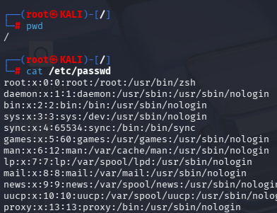
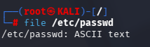
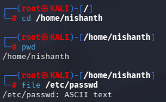
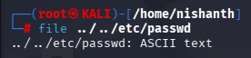
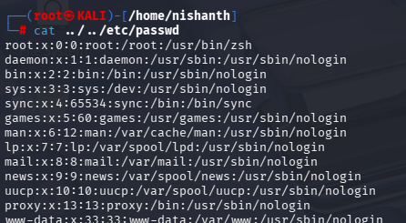

#ABSOLUTEPATH #RELATIVEPATH 

Absolute path is used with / in front of the path 
For Example we want to read the contents of the file passwd
so we can do it via absolute path from any directory by using the /  in front of the directory which contains the file. 

#ABSOLUTEPATH 
Example: cat /etc/passwd

Example: file /etc/passwd

Similarly we can do this sitting in any directory
here we are using file command to check the format of the file from the /home/nishanth directory 

#RELATIVEPATH

**Relative path** → Directions from where you are  
“Go back 2 streets, then take left”
`../../etc/passwd` → relative (depends on location)

we will use the file command here to see the passwd file type from the /home/nishanth directory

we will also use CAT command to check the contents of the file passwd using relative path

