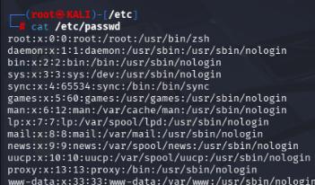
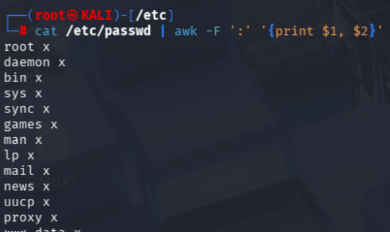

AWK is a powerful data extraction and reporting programming language.

We used the Cut command to extract only the first column of the /etc/passwd file. 

But using AWK we can almost extract any number of columns from the /etc/passwd file. 

This is the advantage of using and awk command. 

Here we are going to CAT the passwd file and then use PIPING to the AWK command to extract the 1st and the 2nd Column of the /etc/passwd file. 

Now we will Pipe it to AWK to extract the 1st and the 2nd column of the file /passwd

Here we have printed the 1st and the 2nd Column of the etc/passwd file. 

-F is the field separator and the print subcommand outputs the resulting text. 