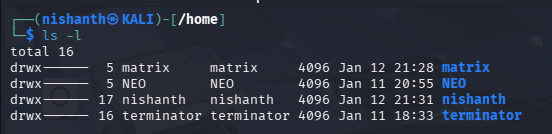
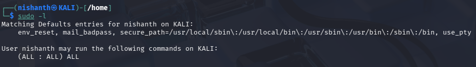
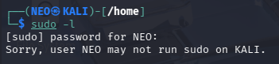
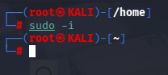
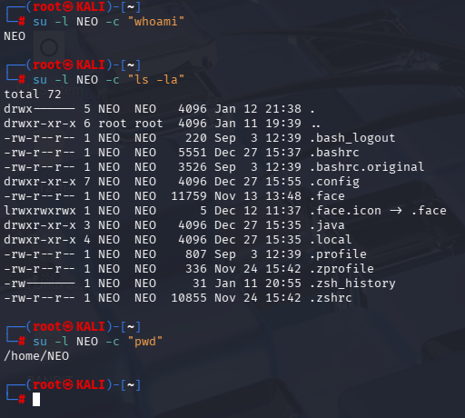

There are 4 Users in this System. 

Now we will check the current user nishanth if it can run as root.

Why it can Run commands as Root is because user nishanth is in the sudo group.

How we can check if the user is in the sudo group. We can run the command > sudo -l

We can see that the User Nishanth can run the following command > (ALL : ALL) ALL
This confirms that the User Nishanth is in Sudo Group. 

Meaning of the above (ALL:ALL)ALL
Meaning:

- Any user in **sudo group**
- Can run **any command**
- As **any user**
- On **any system**

Similarly we can test the same for the User NEO. If he is in the sudo group. 
We will switch back to the User NEO using the command > su NEO

Then we Run the command sudo -l

We see the message > sorry, user NEO may not run sudo on KALI.

If we want to become Root Permanently on the Current Shell, we use the command > su -i
This makes user nishanth wo is in sudoers group permanently root until exiting the Terminal. 

You can Run command as Another USER using the below mentioned command 
Command > su -l NEO -c "whoami"

Breakdown:

- `su` → switch user
- `-l` → login shell (loads user’s environment)
- `NEO` → target user
- `-c "whoami"` → run only this command

In the above example we can see that user nishanth is root and root can execute the command as another user NEO using his login shell environment to Run a single command using the -c flag

On the above example we can see that the we used su to switch user and then used -l to load the login shell of the user and then used -c to run single commands like "whoami" ,  "ls -la" , "pwd"

All those command ran in the user NEO shell environment. 

## SIMPLE SUMMARY

| Command               | What it does                        |
| --------------------- | ----------------------------------- |
| `sudo command`        | Run one command as root             |
| `sudo -i`             | Become root (login shell)           |
| `sudo -l`             | List allowed sudo commands          |
| `su`                  | Switch user (needs target password) |
| `sudo su`             | Become root using sudo              |
| `su -l user -c "cmd"` | Run one command as another user     |
