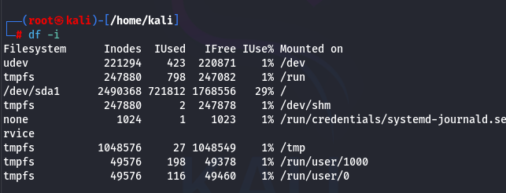

[[OSCP-FUNDAMENTALS/LINUX/LINUX BASIC COMMANDS]]

#memory #diskusage #htop 

#free command to check the resources

#memory 
#free free -m for more readable format

#diskusage command is df

you can see that everything is not easily understandable,
so we use the command df -h

In a Linux Filesystem, we have two types of Disk usage one is via the space and the other one is the Inodes (WHICH IS THE MAXIMUM NUMBER OF FILES)

If either one is full, the files cannot be copied to that specific drive.

the command to check the inodes are full is by using > df -i

#htop

command > htop

#uptime command to check how long the system has been open or running

