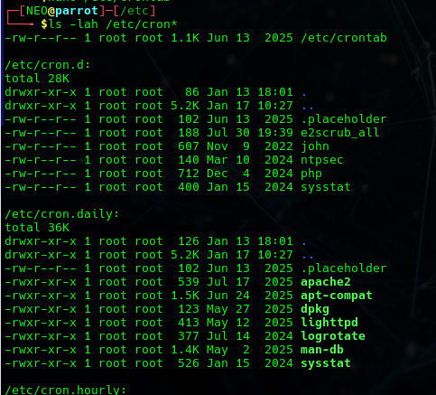

The Linux-based job scheduler is known as Cron. Cron makes it possible to schedule the execution of tasks

Scheduled tasks are listed under the /etc/cron.*

To view the Scheduled Tasks we can use the command > ls -lah /etc/cron*

Tasks that Run daily are listed under the cron.daily

