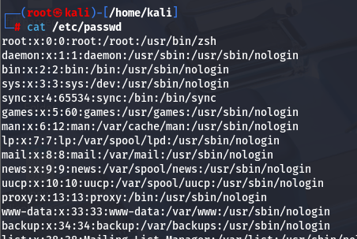
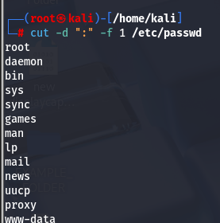

The Cut command can be used to extract certain fields using the Delimited and the Field Command. 

Lets take an Example here for the etc/passwd file. 

command >cut -d ":" -f 1 /etc/passwd

here we are using the delimited command to isolate what comes next to the : and then taking only the field -f from the first column of the etc/passwd file. 

Lets cat the etc/passwd file to see its contents. 

Now lets use the command cut to to print all the first column of the passwd file. 
We will use the  delimiter -d ":" and field -f 1 to /etc/passwd file. 

