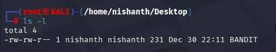
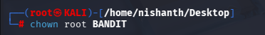
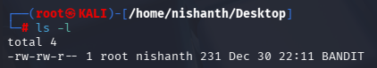

How to change an ownership of a file from a normal user to the Root User.

We use the command > chown

Here we listed the File inside the Desktop by > ls -l

We can see on the above screenshot that the file BANDIT is having the primary owner nishanth

Now we can change the ownership from user to root by using the command > chown

Now we list using ls -l

In the above screenshot we can see that the Primary Owner is changed from nishanth to root.

