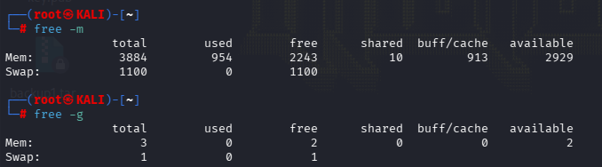
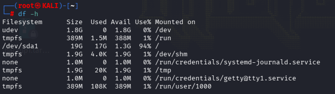
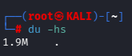
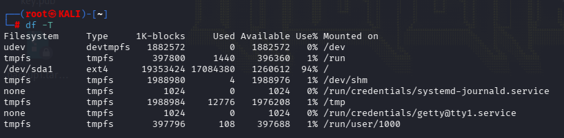
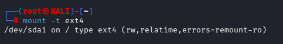
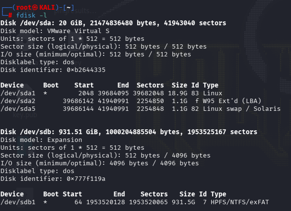
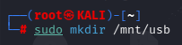
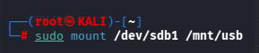
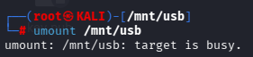

## FREE COMMAND

Displays information on Memory

we can us the flag -m or -g to display in megabits and gigabits

```
free -m

free -g
```




## DISK FREE COMMAND 

Reports on available Disk space on the Disks mounted in the Filesystems

the -h flag means human readable 

`````
df -h
`````




## Determine the size of Files and Directories

```
du /home/nishanth
```

We can use the -hs flag is used to make the output human readable




## Determine the the type of Filesystem

```
df -T
```




## MOUNTING IN LINUX

In Linux we have to Mount a Filesystem. 

Since Linux systems has a single directory tree, if we were to insert a USB drive (for example), 
we would need to create an associated location somewhere in that tree. 
Creating that associated location is called _mounting_.

```
mount -t ext4
```

the -t flag is to show a certain type of filesystem
We will display the partitions formatted as ext4. Hence we will type ext4




# MOUNT A USB DRIVE

After you plug in the USB type the below command to gain some information of the Drive

```
sudo fdisk -l
```



The /dev/sda is our Local Machine 
The /dev/sbd1 is the USB Hard Disk we connected to the USB

Now lets make a Directory to mount the USB into it.
By default /mnt Directory is used to mount external Devices. So we will create a Subdirectory inside /mnt called /usd



Now lets do the Mounting of the USB to the /mnt/usb Directory

```
sudo mount /dev/sdb1 /mnt/usb
```



Once its mounted we can go to the Directory and confirm it


## UNMOUNT A USB

Now lets unmount the USB Hard Disk



The Target is busy because we are inside the Directory

We need to get out of the Directory to unmount.

Enjoy!!


### 📌 COMMAND SUMMARY

### **Memory Information**

- `free -m` → Display memory usage in **megabytes**

- `free -g` → Display memory usage in **gigabytes**


---

### **Disk Space (Mounted Filesystems)**

- `df -h` → Show available disk space in **human-readable** format

- `df -T` → Show **filesystem type** of mounted disks


---

### **File & Directory Size**

- `du /home/nishanth` → Show disk usage of directory

- `du -hs /home/nishanth` → Show **total size**, human-readable, summarized


---

### **Mounted Filesystems**

- `mount -t ext4` → Display mounted filesystems of type **ext4**


---

### **USB / External Drive Management**

- `sudo fdisk -l` → List disks and partitions

- `mkdir /mnt/usb` → Create mount point

- `sudo mount /dev/sdb1 /mnt/usb` → Mount USB drive

- `cd /mnt/usb` → Access mounted USB

- `cd ~` → Exit directory before unmounting

- `sudo umount /mnt/usb` → Unmount USB drive


