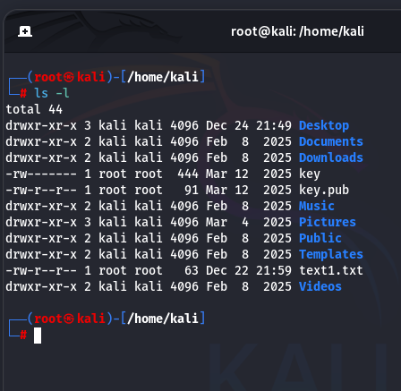
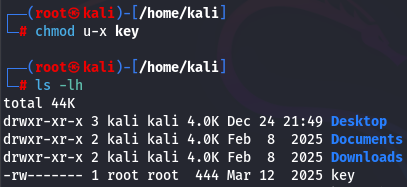
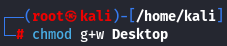
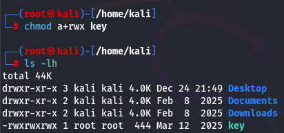

[[OSCP-FUNDAMENTALS/LINUX/LINUX BASIC COMMANDS]]

#chmod 

d|rwx|r-x|r-x|

the first d represents the Directory

the second rwx represents that the primary user of the pc can read write and execute the files

the third r-x means the Group user can read and execute the file but cannot write

the final is for others who can do red and execute only but cannot execute

#chmod ->add executable permission to file
Now if you see the file key.txt is not executable so what can we do to make it executable. 
The command to change the file to executable format is by using command > chmod u+x key
here u means user and x means executable, key is the file.
+

#chmod ->remove executable permission to file
remove executable permission from file
if you want to remove the executable property again from the file we need to type the command
chmod u-x key

#directory chmod 

the same can be applied to the Directory as well. 
In this case we can see that the Desktop Directory is having no WRITE permission.
so in this case we can use the command chmod g+w Desktop

 You can finally see that the write permission is added to the directory

Similarly you can remove the write permission from the group by using the command 
chmod g-w Desktop

No if you want to give everyone the permission to read, write and execute a file, 
you can use the command > chmod a+rwx key

you can see that everyone can read, write and execute the file key

