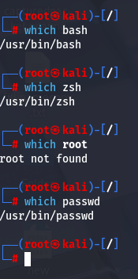
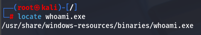
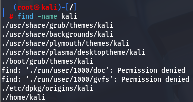
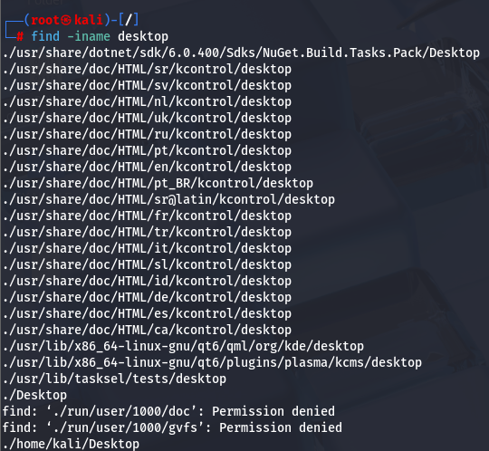

#which #locate #find 

the which command is used to find files with their path
If a match is found, which returns the full path to the file.
COMMAND > which 

#locate

command > locate 

The locate command is the quickest way to find the location of files or directories in Kali. To provide a much shorter search time, locate searches a built-in database named **locate.db** rather than the entire hard disk itself. This database is automatically updated regularly by an automated task.

#find

 **-name** - Search by filename or directory name (case sensitive).
to find a file using its name > find -name nameofthefile

**-iname** - Search by filename or directory name (case insensitive)

 **-type f/d/l/s** - Search by type which can be (files, directories, links or sockets)

**-size** - Search by file or directory size.

 **-mtime** - Search using the last modified date criteria.

 **-o** - Allows us to combine multiple values of the same argument.

**-user** - Find files and directories based on their owner.

