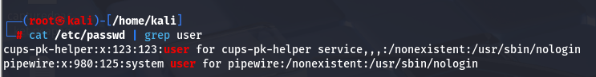
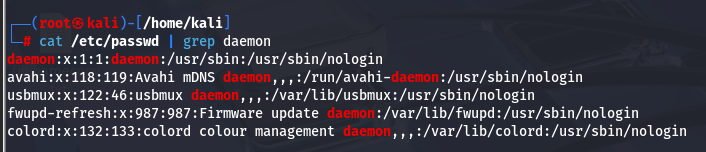

Grep command is used to extract the field which we want to show in the output

Example: 
From the passwd file we want to only extract the field user. Hence, we will use the command as shown below

Similarly we can use for one more word called daemon

