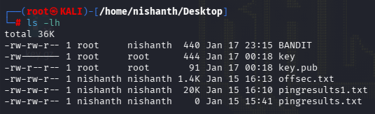
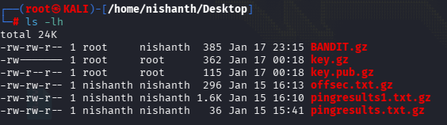
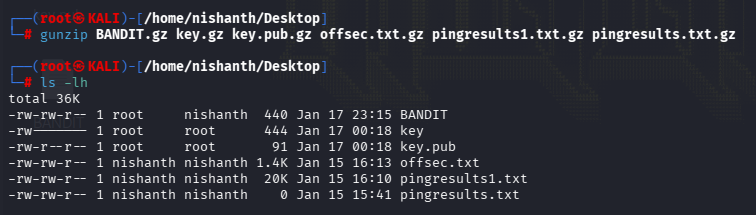
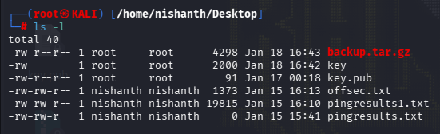
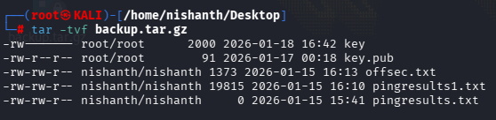

GZIP is used to compress a File.

We will list the contents to compress inside a folder

# Command to compress a file using GZIP

gzip filename

We will GZIP all the files using the command as shown below.
To shorten the typing always press the tab button to show the files and select it 

Now we will see the zip file using - ls -lh

# Command to Extract a GZIP FILE

## GZIP Multiple Files

To GZIP Multiple files we need to first make zip it to TAR
We can then GZIP the TAR File

We will use the command > 

## COMMAND TO GZIP MULTIPLE FILES

c to create a file
z to gzip the file
backup.tar.gz is the name which we have give to the zip file
key, key.pub, offsec.txt, pingresults1.txt, pingresults.txt are the files to get inside the zip folder

## COMMAND TO VIEW THE FILES INSIDE THE ZIP FOLDER

