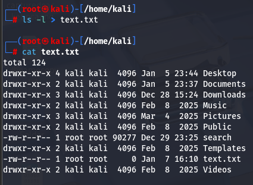

#wc 
We can redirect input of a file to another command using Input redirection

First we will see what wc can do using the help command

We have moved the ls- l to text.txt file using >

Now, we will use word count command wc to redirect the input of text.txt to word count using < command

Here we are using wc -l to count the number of lines of text using -l in wc.

