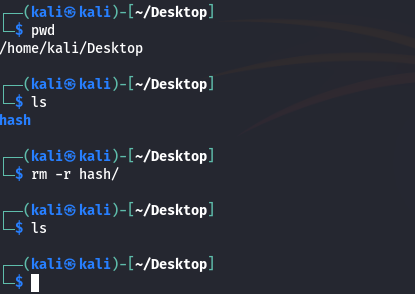
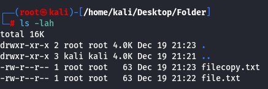

#pwd #ls #ls-a #touch #mkdir #mv #rm #rmdir #rm-r #man #cat #mkdir-p #cp #ls-lah 

COMMANDS to see 
1. CURRENT DIRECTORY
2. LIST FILES
3. LIST ALL FILES INCLUDING HIDDEN FILES
4. CREATE FILES
5. MAKE DIRECTORIES
6. MOVE A FILE
7. REMOVE A FILE
8. REMOVE A DIRECTORY
9. REMOVE A DIRECTORY CONTAINING FILES
10. MANUAL COMMAND FOR CHECKING DEAILS ABOUT ALL COMMANDS
11. TO SEE DETAILS INSIDE A FILE WITHOUT OPENING IT IN TERMINAL
12. MAKE FOLDERS INSIDE FOLDER
13. MAKE COPY OF A FILE

#pwd - current working directory command > pwd

#ls list the things inside a directory or folder > ls 

#ls-a list all the files including hidden files inside a directory > ls -a

notice here that the file names showing dot (.) in front of filename is hidden file. 
here .cache is a hidden file.
if you save a file with a dot in front of it, it is a hidden file. 

if you want to move quickly to your home directory from anywhere inside the file directory you can just type cd without any arguments. command > cd

#touch to create a file
to create a file command is touch > touch file.txt

#mkdir to make a new directory or a folder command is > mkdir

#mv to move a file command is > mv

#rm remove a file command is > rm

#rmdir

#rm-r remove a directory which contains a file command is > rm -r 

#man command to view the details of each command. if you are stuck you can view this man page for details about any command > man 

here an example of man command to see details about remove rm command> man rm

#cat  command> cat to see what's inside a file without opening it in the terminal
        cat -n to display what's inside a folder serial wise

#mkdir-p to make folders inside a folder command > mkdir -p 

#cp make copy of a file command > cp

#ls-lah Lists all file showing the ownership, hidden and human readable

