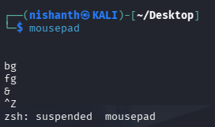
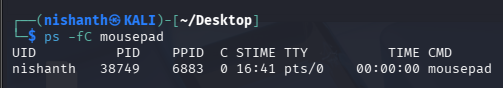
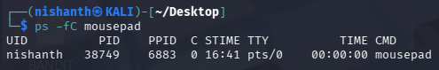
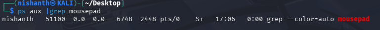

We can List all the Running Processes in the system using the command > ps 

Now we can further see more information on the Running Processes using the additional flags E and F with the ps 
COMMAND > ps -ef

The first (e) selects all processes
The second (f) displays the full format listing (UID, PID, PPID, etc.)

Now lets start the application mousepad and suspend it using the command CTRL+Z

And then again we can start the process of mousepad by using the command bg

We can list the job using jobs command

Now we can see the process of mousepad running using the command > ps -fC mousepad

the f will list the running details like the UID, PID, PPID using the f
then we can only list the mousepad application only using the C

If we want to stop a process we can use the KILL command. 

We will list the PID for mousepad using the command> 

Now we know that the PID of Mousepad is 38749

We can Stop that process using the KILL command

We can verify it suing the command ps aux and GREP the particular process. 

