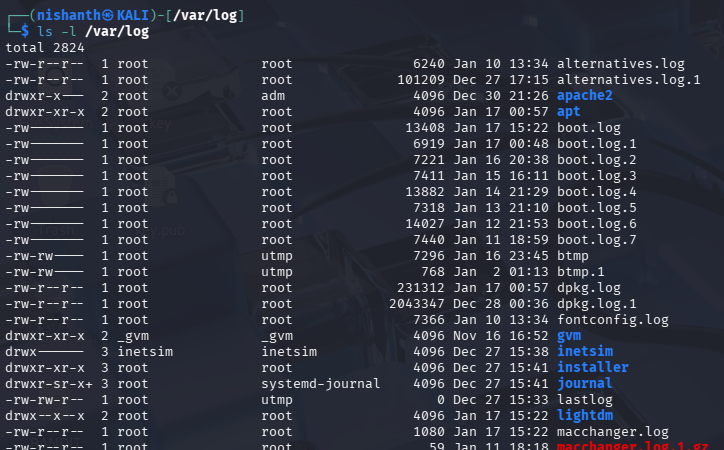
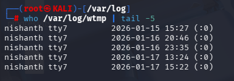

# 📝 Introduction to Log Files

As an **information security professional**, logs are essential to **reconstruct events** after a security incident and understand **what happened and when**.

 Many log files require **root permissions** to read; `sudo` is often necessary.

Most Unix-like systems store logs in: /VAR/LOG

Example listing:

**Notes:**

- Many logs are **plain text files** (can be opened with `cat`, `less`, `tail` etc.).
- Some logs have **special structures** (like `wtmp`).

## Special structured logs -

#### a) `/var/log/wtmp`

- Tracks **login, logout, and runlevel changes**.
- Can be queried using `who` or `last`.

### Kernel Logs

- Kernel messages are stored in a **ring buffer**.
- Use `dmesg` to view kernel logs:

Useful for:
- Detecting **hardware events**
- Monitoring **USB devices**
- Checking **disk errors**

### Systemd Logs (`journalctl`)

- **journalctl** consolidates multiple logs:
- stdout/stderr of services
- syslog messages
- kernel logs

# Show all logs
journalctl
# Reverse chronological order (newest first)
journalctl -r
# Follow new logs in real-time
journalctl -f
# Show logs for a specific service
journalctl -u ssh.service

✅ **Summary**

- `/var/log` → main log storage

- `tail` → last lines

- `who`, `last` → login/logout logs

- `dmesg` → kernel messages

- `journalctl` → systemd logs

- `sudo` → access restricted logs