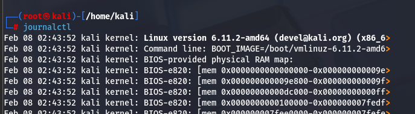
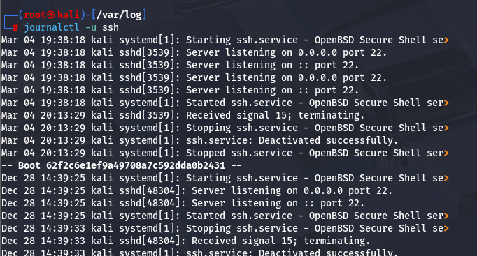
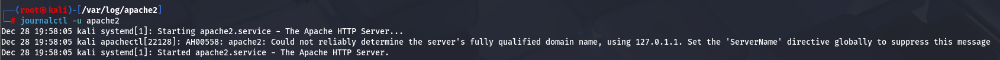
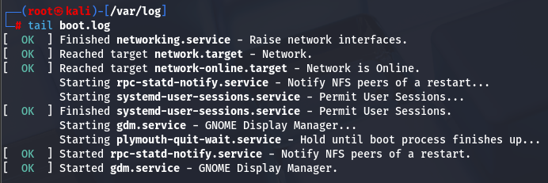

[[OSCP-FUNDAMENTALS/LINUX/LINUX BASIC COMMANDS]]

#journalctl #journalctl-f #journalctl-u #dmesg #head #tail #head-n5 #tail-n5 #tail-f

#journalctl #journalctlfu
you can view syslogs in kali linux using the command journalctl

#journalctl-f 
you may view the latest changes in the logs or view the new logs getting filled up in a new event in system using the command > journalctl -f

#journalctl-u 
if you want to see only the unit in the system log then you need to use the command. journalctl - u ssh 
Here we are going to see only the ssh unit logs 

journalctl -u apache2

#journalctlfu 
we use this command to see the latest logs for a specific service
here we are using it to see the logs for Apache 2 and all its update live
command > journalctl fu apache2

#dmesg
dmesg logs > you can view kernal and hardware logs using dmesg logs > command > dmesg

#head 
if you want to see only the first 10 lines of the file we can use the head command
here we are using to view boot.log file in /var/log directory
command > head boot.log 

if we want we can also see the number of lines we want by adding the command -n5
so we can see only the first 5 lines of the boot.log file. command > head -n5 boot.log

#head-n5 

#tail 
you can view the last 10 lines of a file using the tail command> tail boot.log

#tail-n5 
similarly you can use the tail command to see the last 5 lines also.

#tail-f 

you can view the latest logs of a system logs using the tail -f command

