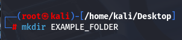
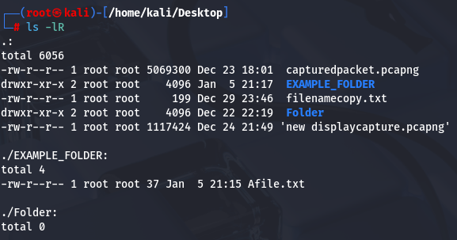

#mkdir #ls-lR 
To make a Directory we use the command > mkdir

We will move the Afile.txt to EXAMPLE_FOLDER

Now we use the ls -lR command to display what's in the Desktop as well as what's inside the Folders which are there in the Desktop.

#ls #ls-lR
command > ls- lR

