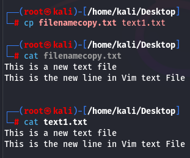

[[OSCP-FUNDAMENTALS/LINUX/LINUX BASIC COMMANDS]] 

#cp
How to make a copy of a file and giving it a newname

Here we have a filenamecopy.txt for which we made a copy with a new name text1.txt

[[OSCP-FUNDAMENTALS/LINUX/LINUX BASIC COMMANDS]] 
#diff 
 to find difference between two files
 here we used the command on the copy of the filenames 
there was no output indicating that both the files are the same

#mv move all text-files together to a folder

#mv move all text files from a directory to one directory backwards

#mv 
rename a file with move command 

similarly you can also replace a file with move command 

