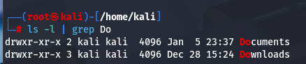
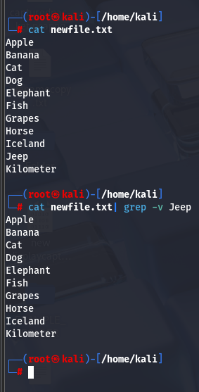
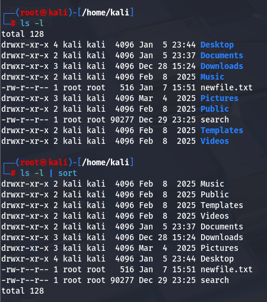
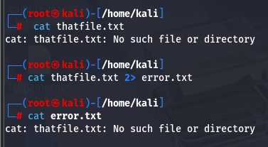
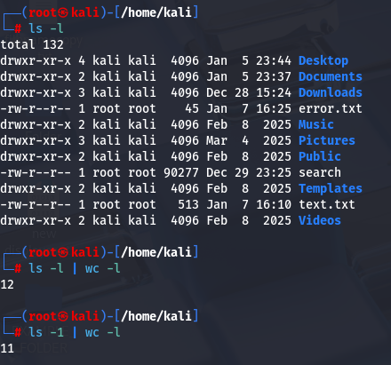

#outputredirection #outputredirectionadd #grep #grep-v #redirectErrorMsg 

We can redirect an output of a command to a file using the ">" command

command > 

Here we have redirected the output of echo to the xfile.txt by using the command ">"

Now we will again redirect the output of echo to the xfile.txt by using the command ">" many times. What we see is that if we redirect the output to the same file, It is going everything inside that file. It will not ad extra lines into the file. It will only replace the file with the output of echo.

#outputredirectionadd 
What if we want to add the extra lines or text inside the file using the output redirection command ">"? We cannot do it with the > command. Instead we have to use the command >>

The >> command will redirect the output into the file adding into the file instead of replacing. 

command >> 

#grep > Show the specific characters which we want to see.
What Grep does is Limit the Output to what we want. 

Suppose we want to list using ls command the Directories or files starting with Do

Hence, we can chain the commands to ls -l using | 

command > ls -l | grep Do

#grep-v - Remove a specific Line and show others using GREP

Now we have created a file named newfile.txt which contains Alphabets in Order.

command : grep -v
Suppose we don't want to see certain characters in the list. we can use the grep -v command

command > grep -v

 
 SORT
We can sort contents inside file or listing inside directory by piping it to the sort command

#redirectErrorMsg 

How to Redirect Error message to a file. 

We use the command 2> 

Here we are going to cat a file that does not exist and then redirect the error message of the command to error.txt using 2> operator

**Counting Actual Files inside the folder /home/kali** **or any Directory**

we normally use the command ls- l to list the files inside the folder or a directory

When we use the ls -l by piping it with the word count with number of lines wc -l command

We can see that it shows extra one file. What we can do it to use the command ls -1 | wc -l

to list the files by subtracting 1 to it.

