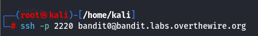
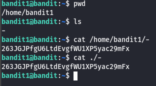
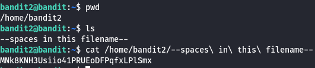
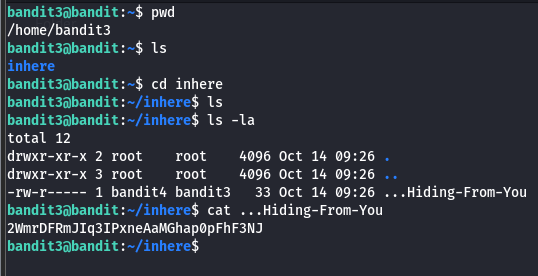
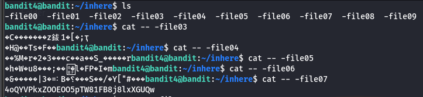

#ssh #dashedfilename #spacesinfilenames #hiddenfile 
to connect to another pc using ssh
command > ssh -p portnumber user@ipaddress
if the ip address is not known then type the website id

LEVEL 0
password for next level > ZjLjTmM6FvvyRnrb2rfNWOZOTa6ip5If

WEBSITE ID: bandit.labs.overthewire.org

 Bandit Level 1 → Level 2
#dashedfilename How to CAT file name starting with -

password > 263JGJPfgU6LtdEvgfWU1XP5yac29mFx

Bandit Level 2 → Level 3
#spacesinfilenames > how to CAT filenames having space in between them

Bandit Level 3 → Level 4
#hiddenfile >How to CAT Hidden files
command> cat filename

Password > 2WmrDFRmJIq3IPxneAaMGhap0pFhF3NJ

Bandit Level 4 → Level 5

How to CAT a file with filename -file00
command> cat  -- -file00

password > 4oQYVPkxZOOEOO5pTW81FB8j8lxXGUQw

