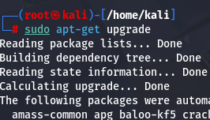
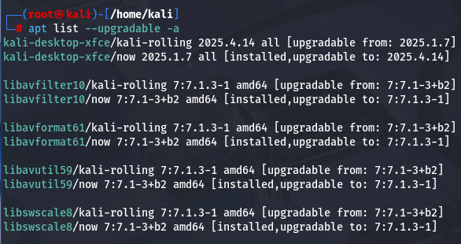
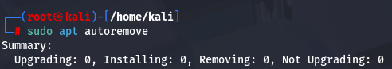

[[OSCP-FUNDAMENTALS/LINUX/LINUX BASIC COMMANDS]]

to update the list of local repository in system > sudo apt upgrade or sudo apt-get update

after updating to the latest repositories from command sudo apt update, the next thing you can do is to install those updates using the command sudo apt upgrade or sudo apt-get upgrade

if a package is not updating then you can use the command sudo apt list --upgradable to see the files which are not installed and their reason. apt list  --upgradable -a is used to list all the version of the software which are not installed.

you can then see the name of the software's which are not updated and install them using apt install command.

After installing the updates you can see that there are many dependencies which are not required which can be removed using the command apt autoremove

if you want to autoremove and install all the pending software's you may use the command apt dist-upgrade

