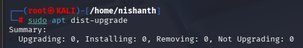
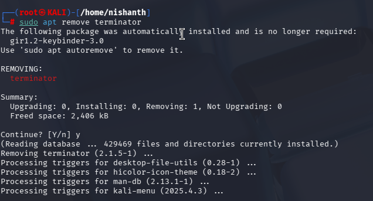
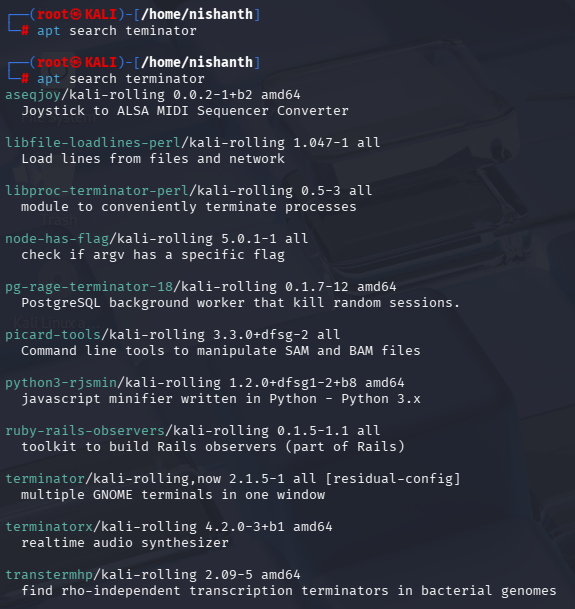
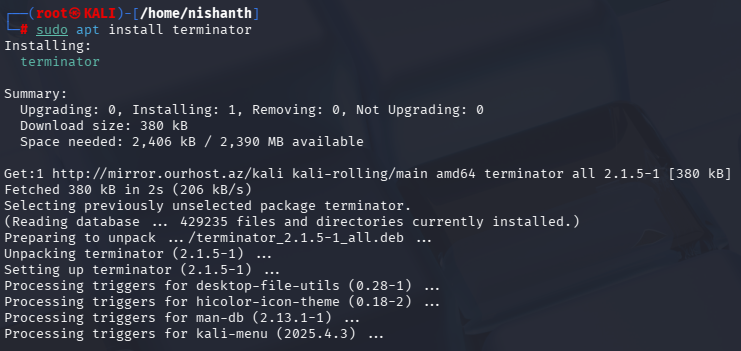
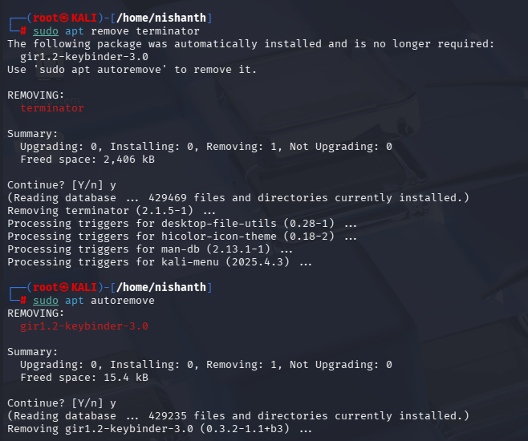

[[PACKAGE MANAGEMENT]]
#apt #aptupdate #aptupgrade #aptdistupgrade #aptremove #aptsearch #aptinstall #aptautoremove 

Update Repository Index: Every Linux system you have a concept of Repository. A Repository is an Online Server which contains one or more packages.

Most of the the Time your Distribution of Choice (in our case Kali Linux) will have a main repository where everything comes from and you have other repositories that will contain other packages

#apt command > apt

apt is package management utility that simplifies installing, updating, removing, and managing software by handling dependencies and connecting to software repositories.

You have to make sure that your local repository in system is updated so that we can get all the latest packages and updates from the repositories online. 

#aptupdate command is > sudo apt update
We need to first update our local repository with the actual online repository using the command > sudo apt update
What did it do? It basically reached out to servers that basically reached out to you to download the indexes from.

#aptupgrade command > sudo apt upgrade > It will actually update the packages into the system. It will update any packages in your system that don't require something to be removed 
or something else installed as a prerequisite. It only does it as a one for one. 

#aptdistupgrade commmand > sudo apt dist-upgrade 
it will update anything which upgrade command didn't update

Here you can see that there was no upgrade because we individually updated the updates which were not upgraded using the sudo apt upgrade command. So this will autoremove the unwanted packages and also install the unupdated packages which were left by sudo apt upgrade command. 

#aptremove
to remove a Software from Kali command is > sudo apt remove software name

#aptsearch 
the apt search command is used to search for packages from the repositories

command > apt search terminator

#aptinstall > to install packages
command> sudo apt install terminator

#aptautoremove 
command > sudo apt autoremove

sometimes when you install a package in a linux distro of choice, the software requires some dependencies or other additional resources which installs together with the software.

So what happens when you remove the software.

then the software additional files must be removed too. As sudo apt remove will not remove those additional files. 

Hence we use the command sudo apt autoremove

you can see in the above example that girl.2-keybinder-3.0 was not remove using sudo apt remove terminator command

Hence, we used the command sudo apt autoremove command to remove it from the system.

