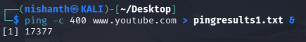
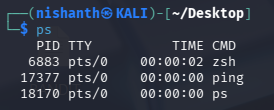
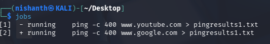
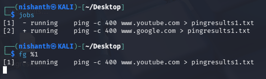
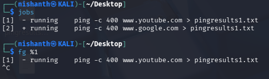

To Run process in the background we need to put & sign after the command
For Example as below -

We want to ping google.com
So we are going to send 400 ICMP packets to the website 

command > ping -c 400 google.com > pingresults1.txt & 

Notice the & symbol at the end represents to send this action to the background.

Now this command is running in the background letting us to work with other commands in the Terminal.

We can see the Processes which are running in the background using the ps command

If we had not supplied the "&" symbol, the command would have run in the foreground, and we would be forced to either **CANCEL** the command with **CTRL+C**, wait until the command finishes to regain control of the terminal, or **_SUSPEND_** the job using **CTRL+Z** after it has already started.

If we suspend a Job using the CTRL+Z command. If we want to Resume the Job again we can use the bg command.

We can list the Running Jobs in the background using the command jobs

Here we can see the two jobs are Running.

We can move the first job to the foreground using the command fg %1

We can Terminate the process using the command > **CTRL+C**

