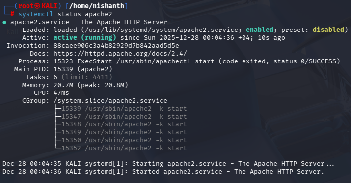
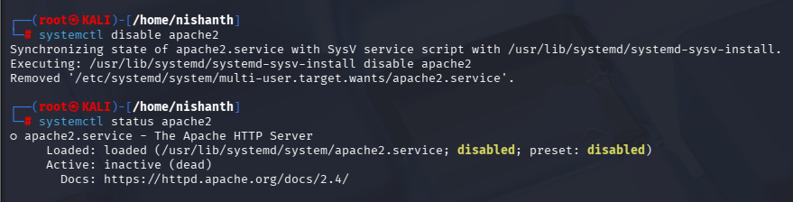
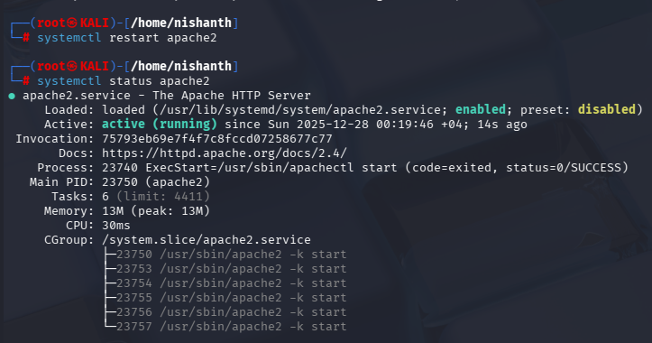

#systemctl #systemctlstatus #systemctlstop #systemctlrestart 

systemctl is a command used to start a service in a server. 

In this example we are taking a look at the service called apache2 which runs as a webserver inside a server. 

#systemctl to start a service
to start the apache 2 webserver service in browser type command> systemctl start apache2

#systemctlstatus > to check the status of the service
command >systemctl status apache2

#systemctlstop > to stop a service
command > systemctl stop apache2

#systemctldisable > to make the server service dead> systemctl disable apache2

#systemctlrestart > systemctl restart apache2

