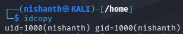
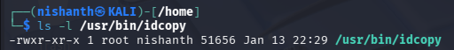
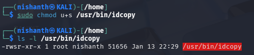
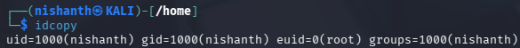
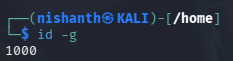
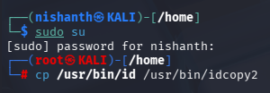
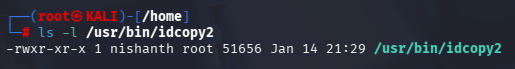
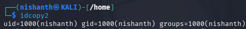
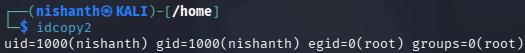
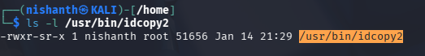

## SETUID

SETUID is special permission assigned by Administrator to those Files which require root privileges required by Users for doing their specific jobs done. 

We need to first change the ownership of a file by using the chown command. Now this is done to make the file root owned but still its run by the User and has User Privileges.

We can elevate the privileges by assigning it a SUID Bit. So that the File is run by the User who requested for their Job to be done with Root Privileges only for that file. 

Lets take this example. We will use the id command for this purpose. 

Lets make of copy of the popular id command. 

cp /usr/bin/id /usr/bin/idcopy

Now this will make a copy of the id command. 

Lets check the idcopy command



Here we can see our UID and GID

Now lets change the ownership of the file from nishanth to root.


Lets ls -l



We can see that the Ownership of the File is changed from nishanth to root by using the chown command.

Now lets change the permission of the file to SUID bit so that it runs with the elevated privileges of root. The user runs it but it runs with elevated privileges of root. 





We used chmod command to give the file suid bit permission to run as root. 

We confirm it by typing ls -l and we can see that "s" after rw which confirms that suid bit is set.



Also you can see that the euid which is the effective user id is 0 which confirms that the file is run with elevated privileges of root. 


## SETGID

To see the effective Group of the current user we can run the command id -g




Now we will make another copy of the id to idcopy2



lets change the ownership of the group to root


Now lets ls -l



We can see that the group ownership has changed to root

Now we will also check the idcopy2 



We can see that the gid is 1000

Now lets change the permission of the group by assigning it a setgid bit


Now lets check the idcopy2 command



no we can see that the setgid has changed to 0 confirming that the sgid bit is set.

we can also run the ls -l to see the setgid bit set



Setgid is also used for Directories. 

The Administrator creates a Shared folder Named Folder to be share with X,Y,Z who are members of a Specific Group name GREP. 

Now if the SETGID is set to the "Folder", the Users X,Y, and Z if they make any Files inside the Folder, the File will Automatically inherit the Parent Group instead of their Individual Groups they are In. 

## STICKY BIT
The _sticky bit_ (symbolized by the letter "t") is a permission that is only useful in directories. It is commonly used for temporary directories where everybody has write access (such as /tmp/). It restricts deletion of files so that only their owner or the owner of the parent directory can delete them. Without this, everyone could delete each other's files in /tmp/.


```
kali@kali:~$ ls -ld /tmp
drwxrwxrwt 18 root root 4096 Mar 19 11:39 /tmp
```


