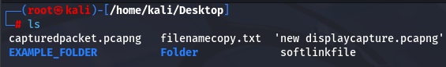
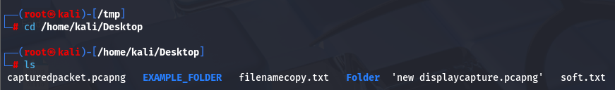
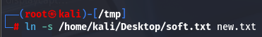
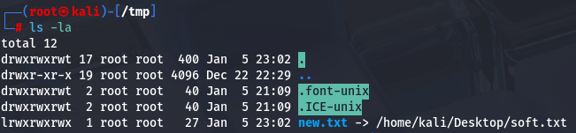
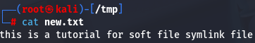
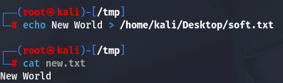
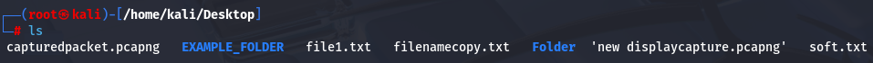
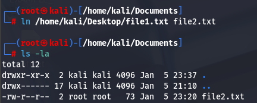
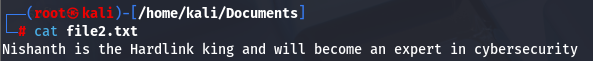
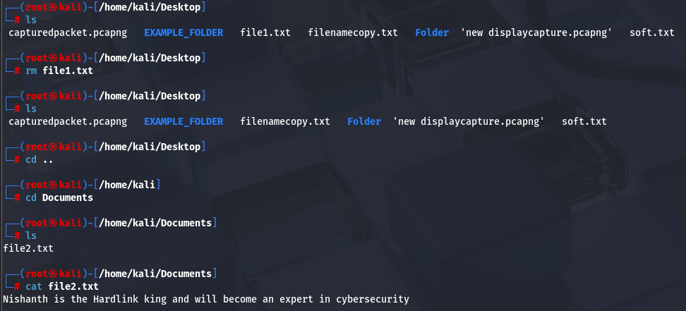

#symlink/softlinks #symlink/hardlink 
Symbolic Link is a shortcut that points to the Original File or Directory

There are two types -
1. Soft Link
2. Hard Link

Soft Links allow us to Mirror the contents of Original File to New One. 
This means that if we modify the original file, then it will modify the symlink file also. 

We created a file using touch called softlinkfile
We inserted text using echo into the softlinkfile and directed some text into the file using > command and made it into a text file. 

We renamed the file softlinkfile.txt to soft.txt using mv command > mv -f softlinkfile.txt soft.txt

Now we will create a softlink inside a /tmp folder

#symlink/softlinks 
soft link command > ln -s location/filename.txt newfilename.txt

We have created a soft symlink to the file in desktop soft.txt to a file inside tmp folder called new.txt

Now when we use the ls -la command we can see the softlink created to the file new.txt to the file in Desktop named soft.txt

Now when we CAT the file new.txt it will show the same content of what's inside the soft.txt file.

Now if we change the contents of the Desktop file soft.txt file, the same changes will be reflected inside the new.txt file inside /tmp folder.

#symlink/hardlink

Hardlink is exact copy of the Original File. 

cmd > ln /filelocation/filename.txt newfile.txt

Here we are going to create a hardlink to a file named file1.txt which is in the Desktop from the Documents folder. 

We can see the file file1.txt in the Desktop

Now we will navigate to the Documents folder and create a hard-link to the file file1.txt which is in the Desktop

You can see that the file2.txt is created and it will contain the same content of the file1.txt which is in Desktop. 

Now, even if we remove the file1.txt from the Desktop the file2.txt inside the Documents folder will still remain with the same contents which was inside file1.txt. This is because hardlink is the exact copy of the file. 

