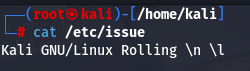

#CheckDistributionVersionofOS #CheckKernelName #CheckKernelVersion #CheckKernelRelease #CheckallOSinformation 

In a penetration testing scenario, once we obtain access to a target, one of the first things we might want to do is called _system enumeration_. This is a fancy term for information gathering about the system to better understand the machine we've attacked, often to elevate our permissions.

#CheckDistributionVersionofOS > cat /etc/issue
We can get the version of the distribution by reading the **/etc/issue** file.

#CheckKernelName >uname
We can check the Kernel name by typing the command > uname

#CheckKernelVersion > uname -v
We can check the Kernel version by adding the flag -v to uname

#CheckKernelRelease > uname -r
If we wanted to get the kernel release we can use the **-r** option

#CheckallOSinformation 
Finally, we can print all the information accessible by **uname** with the **-a** option.

