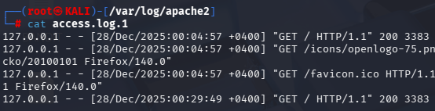
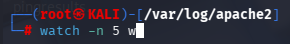
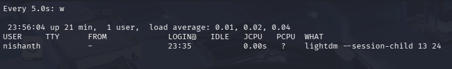

During Penetration Test it is extremely valuable to monitor Files and Commands in real time. Tail and Watch are the two commands which Help us do that. 

The Tail Command is used to Monitor Log Files. 

If we use the command Tail -f. The F flag (follow) which updates the last lines of the log every time an event happens. 

Command > tail -f /var/log/apache2/access.log

Also we can see the specific Number of Lines of the Log Files using the command > tail -nX 

Here X denotes how many you want to see. Ex: tail -n5 

## WATCH

The Watch Command is used to Monitor Files every N number of seconds. It keeps on updating on the Intervals we specify. 

command > watch -n X w

1. Here watch is the command to Monitor
2. -n is the Interval to specify the update interval
3. X is the Interval number which we want. Like 5 for instance will update every 5 seconds
4. w will List Logged in Users
