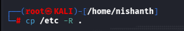
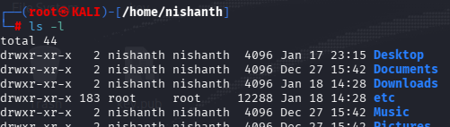
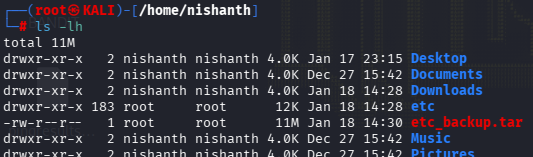
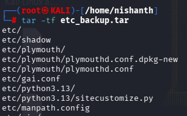
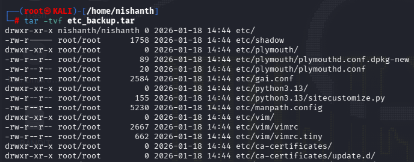
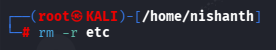
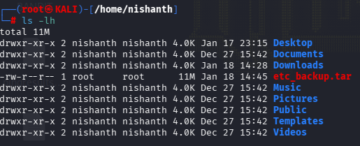
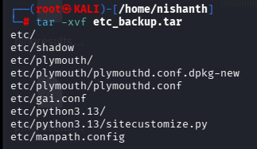
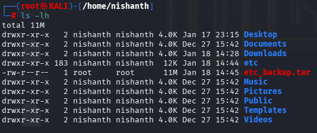

TAR command allows us to combine multiple files into one archive file.
TAR is like a ZIP file but the only difference is ZIP is compressed whereas TAR is Not Compressed.

## HOW TO CREATE A  TAR FILE 

#### COMMAND > tar  -cf filename.tar full path of the location

First we will make copy of the etc directory using the command cp /etc -R .
Here R means Recursively meaning to copy all the files inside Directories which are subdirectories.
Here . means to copy in the Directory where we are presently in which is /home/nishanth

We will use ls -l to list the files inside the current directory to verify if the file is copied.
Here we can see that the file etc is copied.

## TAR COMMAND

-c means to create
-f means to create a filename
etc_backup is the filename of the file and .tar is the extension of TAR files
etc is the Directory which we want to TAR

Now to see the File > ls -lh

## HOW TO LOOK AT WHATS INSIDE A TAR FILE WITHOUT EXTRACTING IT

When we want to see what's inside of a TAR file without opening it we can 
use the command > tar -tf etc_backup.tar

-t is to see what's inside
-f means the filename
etc_backup.tar is the file which we want to see

## HOW TO LOOK ALL THE DETAILS INCLUDING THE OWNERSHIP DETAILS WHILE CHECKING INSIDE A TAR FILE WITHOUT EXTRACTING IT

We can use the flag -v

command > tar -tvf etc_backup.tar
t is to view files without extracting it
v is the Verbose command to view all the Details
f is the file name

## How to Extract a TAR File

We can Extract a TAR File using the command > x

## command > tar -xvf etc_backup.tar

First we will Remove the directory which we copied into our directory /home/nishanth

Now, we will Extract the File using the command > tar -xvf etc_backup.tar

Lets check if it is extracted 

We can see the etc folder.

Enjoy!!

