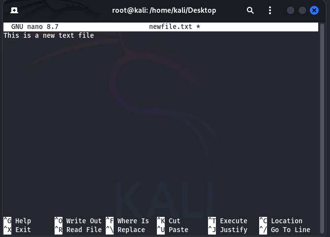

[[OSCP-FUNDAMENTALS/LINUX/LINUX BASIC COMMANDS]]

#nano #savefile #vim #savefilevim #quitfilevim 

NANO

#nano to create a new text file using command > nano newfile.txt

#savefile 
you can save a file in nano using the command CTRL + O

After pressing CTRL+O it will ask show Write to File: newfile.txt 
Please press Enter and press CTRL+X to Exit the editor

 VIM
#vim

command > vim 

Press I to Enter Insert mode

Start Typing in the VIM Text Editor

Press ESC to exit Insert mode and Enter Command Mode

#savefilevim 
To SAVE FILE type :w filename.txt

#quitfilevim 
to QUIT type :q 

