How to add a User 

Command > useradd -m neo 
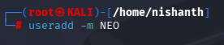
Here -m denotes that the Home Directory for the User will be created. If you don't put it, it wont create the Home Directory for that User. 

Here there are 4 users. We list it in the /home directory using ls -l command

How to Lock a User
Command > usermod -L NEO
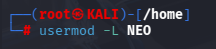

How to check if a User is Locked
Command > passwd --status NEO
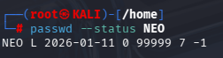
Notice the L which is next to the user NEO it means that it is locked
Now the User will not get authenticated. 

How to check if an account is not expired.
Command> chage -l NEO
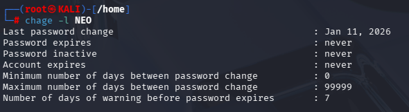

Here we can see that Account Expires is never. This means that the account is Active. 

How to change the Default shell of the User from /bin/zsh to /bin/false (or) sbin/nologin
Command> usermod -s 
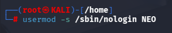

How to check the User login access to the shell blocked.
Command> grep ^ NEO /etc/passwd
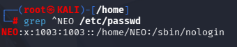

We can see that the User NEO has no Login to the Shell which is zsh.

How to make the User account Expired.
Command > chage -E 2025-11-01 NEO
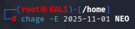

How to check about the user if expired or not.
Command > chage -l NEO

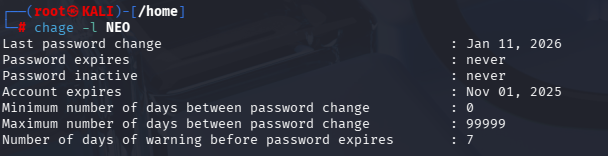

Now lets give access one by one to the User Neo by unlocking the User 
Command > usermod -U NEO
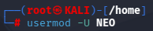

Then Check the status of the Unlock. Here we can see the P. This means that the User is Unlocked.

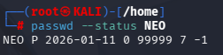

Now, Lets extend the expiry of the account

Command > chage -E 2028-12-30 NEO
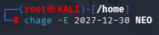

Check the Latest Expiry
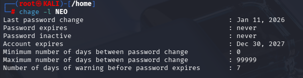

Now, lets make the User access the Shell so that the User NEO can access the Shell.

If you see when we try to change the USER to NEO using the command > su - NEO
It doesn't let us Login. 
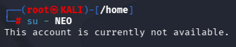

Check the shell status for NEO Command> Grep ^ NEO /etc/passwd
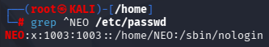

Now lets give the access to the Shell to User NEO
Command > usermod -s /bin/zsh NEO
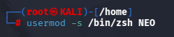

Lets check the status now. 

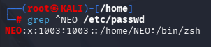

NEO has access now. Lets Login
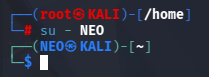

Success!!!

Enjoy!!