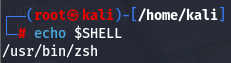
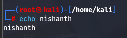
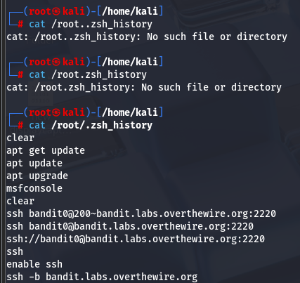

#echoshell #history #alias 
To know which shell environment we are working on we use the command >echo $SHELL

We can set values to Variable inside the Shell. Example: We use the variable nishanth and assign the value 2026 to it

We can then reference it using the **echo $nishanth** command.
Command : echo $nishanth

Notice that when we use echo without the dollar sign the value is not displayed this is because it zsh treats it as normal string.  

#history
We can view the History of the commands used by the user by using the command > history

It is store in the file --> /root/.zsh_history

to see the file location of history you can use the command > echo $HISTFILE

We can explore the _history of commands run by the current user by with the **history** command, or by printing out the ~/.zsh_history

#alias

We can use alias to run commands inside a present terminal or environment by using the command > alias la=ll

This will make ll command to run as la inside the present terminal known as the environment

If you close the environment or the terminal, the new terminal will not run the alias. 

to make the alias permanent we need to edit the source **~/.zshrc** 
